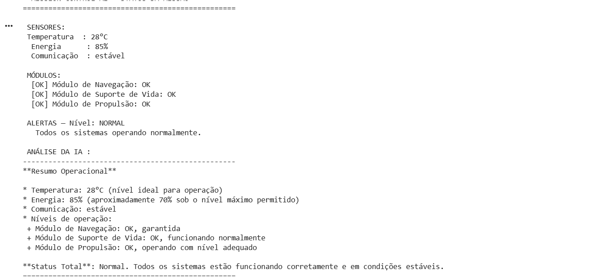
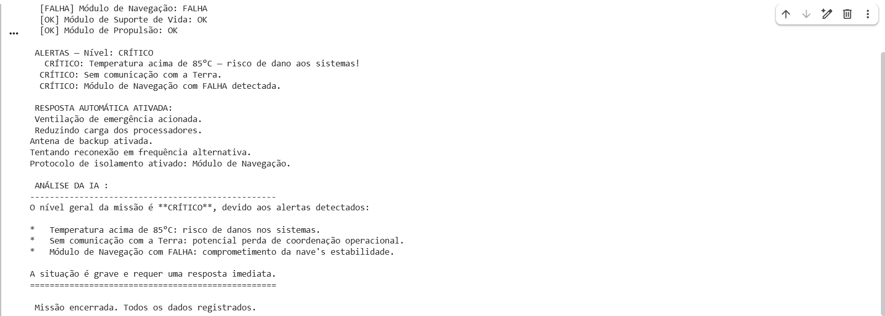

Global Solution 20226- IA

Integrantes:
- Giulliana Brasolin — RM: 569381
- Mikaella Lucindo — RM: 573775
- Lara Alves — RM: 573827

## O que o projeto faz

Sistema de monitoramento de missão espacial desenvolvido em Python.
Utiliza o modelo de linguagem Llama 3.2 via Ollama para analisar dados 
simulados de sensores da nave como temperatura, energia, comunicação e
status dos módulos,e também gera alertas automáticos e respostas de emergência 
quando a missão entra em situação crítica. A IA analisa os dados 
e recomenda ações para a tripulação em tempo real.

## Demonstração
Normal:

Critico:

## Tecnologias Utilizadas

- Python 3
- Google Colab
- Ollama
- Llama 3.2 1B
- Biblioteca ollama (Python)
- Biblioteca random (Python)

## Como executar

Abra o notebook no Google Colab:

[Acessar Notebook](https://colab.research.google.com/drive/1gPklYoitZMwdOGFQX0oHhXgJpxKDV7N9#scrollTo=FsLb3gE9kQra)

## Video de Demonstracao

[Assistir ao vídeo](https://link-do-video.com)
